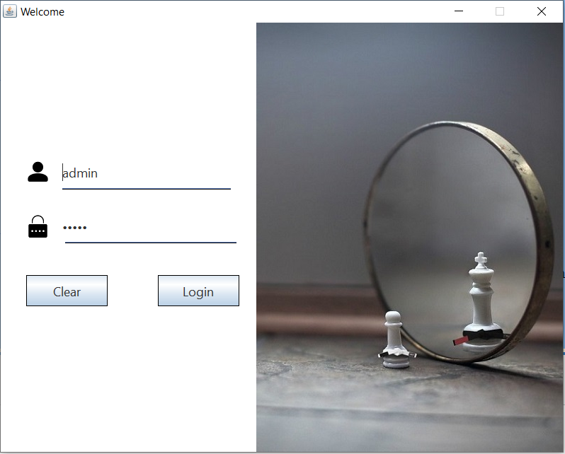
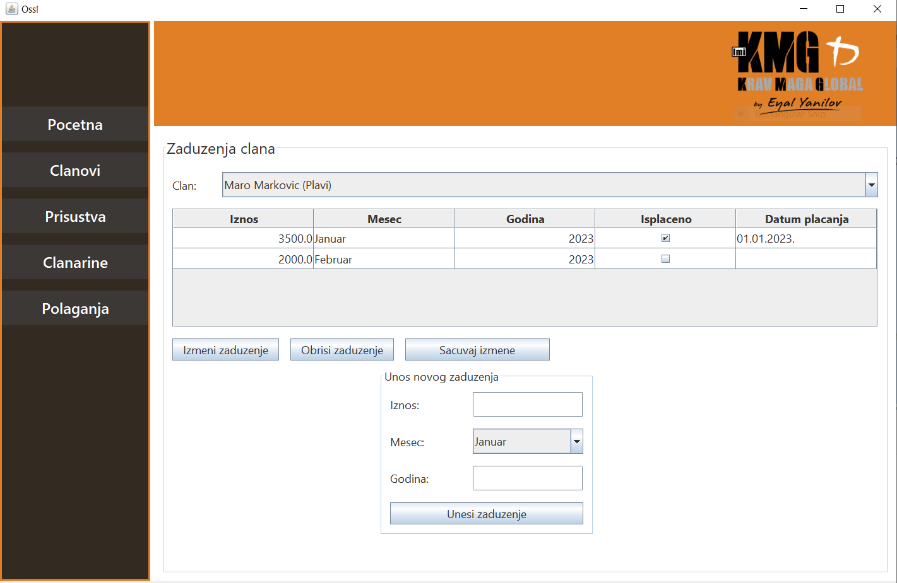

# Martial Arts Gym Management System

This project is a desktop application designed to manage various aspects of a martial arts gym, including tracking belt exams, payments, member data, and attendance.

## Main Components

### 1. **Client**

The **Client** is a desktop application that allows users (e.g., gym staff or administrators) to interact with the server and manage gym data. It provides a graphical user interface (GUI) to:

-  Add, update, or remove gym members.

-  Track and log attendance for each member in class.

-  Manage belt exams and monitor members' progress.

-  Record and view monthly payments made by members.

The client communicates with the **Server** to request data and perform actions like member registration, attendance tracking, and payment management.

### 2. **Server**

The **Server** handles client requests and processes them accordingly. It is responsible for:

-  Managing data for gym members, attendance, payments, and belt exams.
-  Storing and retrieving data from a relational database.
-  Handling multiple clients simultaneously using threads (`ClientHandlerThread`), which allow concurrent operations without blocking other requests.
-  Exposing an API that the **Client** uses to request actions such as adding members or fetching payment history.

Each client request is handled by a dedicated thread, ensuring that multiple clients can interact with the server concurrently without affecting performance.

### 3. **Common Library**

The **Common Library** (located in the `common/` folder) contains shared resources, utilities, and code used by both the **Client** and **Server**. It includes:

-  Models and data transfer objects (DTOs) for entities like members, payments, exams, etc.
-  Utility classes for communication between the **Client** and **Server**.
-  Shared constants and configuration settings.

This common code ensures that both the **Client** and **Server** have a consistent understanding of the data and operations they are working with.

## Features

-  **Server**: Manages connections from multiple clients, handles requests for member data, attendance, payments, and exam records.
-  **Multi-threading**: Each client connection is handled by a separate thread, allowing concurrent interactions without blocking others.

-  **Client**: A desktop application for interacting with the server to manage members, attendance, payments, and exams.
-  **Database Integration**: Data is stored in a relational database, with tables for members, attendance, exams, and payments.
-  **Configuration**: Server and database configurations can be set via the GUI or by editing the `.properties` files.

## How It Works

-  Client: Interacts with the server to manage gym data. Sends requests for adding members, logging attendance, managing payments, and tracking exams.
-  Server: Listens for client requests and handles them using separate threads. Processes data and stores/retrieves it from the database.
-  Database: Stores all relevant gym data (members, attendance, exams, payments).
